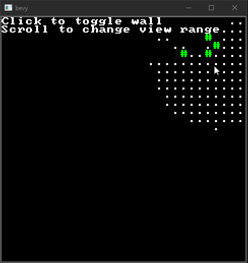

# RoguelikeFOV
## A Rust implementation of [Adam's FOV algorithm](http://www.adammil.net/blog/v125_Roguelike_Vision_Algorithms.html#mine)

### Usage in Сargo.toml
```toml
roguelike_fov = { git = "https://github.com/ztry8/roguelikefov" }
``` 

### Example
```rust
use adam_fov_rs::*;

// Create a 50x50 visibility map
let mut map = VisibilityMap2d::new([50,50]);

// Set the tile at (15,15) to opaque
map[[15,15]].opaque = true;
 
// Compute our visible tiles and add them to the map
fov::compute([15,14], 5, &mut map);

// The space directly above our opaque tile is not visible
assert!(!map[[15,16]].visible);
```


